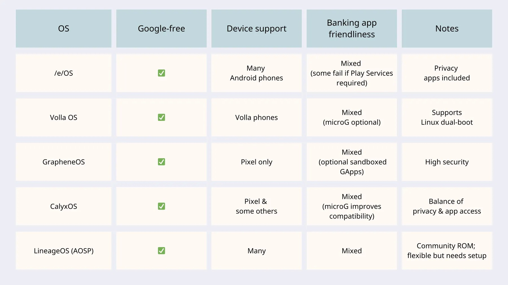

# Telefono privato (*anonimo*)

In questi giorni in molti mi hanno chiesto se e come poter avere ed usare un telefono "*Anonimo*", così ho pensato di scrivere quì le mie considerazioni in modo da renderle accessibili a tutti.

## L'anonimato non esiste!!

Iniziamo con il dire che nella telefonia, **l'anonimato non esiste**. 
Un telefono ha un seriale (IMEI) univoco. Anche una sim (o eSim) ha un seriale (IMSI) e questi due codici (insieme ad altre informazioni), quando accendete il telefono, vengono inviati ad una cella che vi darà accesso alla rete. Oltretutto, la cella, conoscerà la vostra posizione. 
Questi due codici, andranno a formare una **identità** sulla rete. Questa identità può essere **pseudonima**, ma non *anonima*. 
Questa identità rimarrà registrata negli archivi per anni ed anni, pertanto, da quel momento, quel telefono non sarà più anonimo.

### **Iniziamo quindi dicendo che: un telefono *ANONIMO*, non può esistere!** 

Una volta precisato questo punto, vediamo alcune considerazioni su come poter "creare" un telefono "pseudonimo" e di come poterlo mantenere.

## Marche, modelli, ROM e grandi spioni

Mi spiace per tutti gli amanti del *melafonino*, ma un iPhone non è adatto per questo scopo. 
Questo perché un iPhone dipende al 100% dall'ecosistema Apple e tutto transiterà comunque dai loro server. 
Browser alternativi, VPN, TOR o similari, su un melafonino, sono comunque palliativi visto che tutto il traffico internet passerà inesorabilmente tramite Safari.

Abbandonata quindi la mela morsicata, guardiamo **BigG**.  Innanzitutto, non crediate che Google sia meglio solo perché Android è basato su linux anche perché iOS ha Unix come sottostante.  Oltre a questo, il framework di Google, sa esattamente tutto quello che fate con il vostro smartphone. 
Cosa fare allora?  Come possiamo slegarci da questi spioni?

### ROM alternative

Come forse già saprete, alcuni telefoni Android si possono modificare installando ROM alternative. 
Per capire se un vostro dispositivo può essere modificato, fate riferimento al sito che è da sempre un punto di riferimento per le operazioni di modding degli smartphone: [:link: XDA](https://www.xda-developers.com/). 
Negli anni il sito si è evoluto ed ha inizato a dedicarsi anche ad altri settori, ma rimane comunque il punto di riferimento presentando tutte le novità su [:link: custom ROM](https://www.xda-developers.com/tag/custom-rom/), ma per vedere se il vostro smartphone è modificabile, il posto giusto da consultare è [:link: XDA Forum](https://xdaforums.com/all-forums-by-manufacturer).

Quelle di seguito sono le ROM che maggiormente tutelano la vostra privacy. 
L'ordine in cui le posiziono, indicano una preferenza personale e mi riservo di variarlo nel corso del tempo.

1. GrapheneOS [:link: grapheneos.org](https://grapheneos.org/) [^1]
2. LineageOS [:link: lineageos.org](https://lineageos.org/)
3. e/OS [:link: e.foundation](https://e.foundation/e-os/)
4. CalyxOS [:link: calyxos.org](https://calyxos.org/)
5. Volla OS [:link: https://volla.online/.../volla-os/](https://volla.online/en/operating-systems/volla-os/)

### Attenzione!! Queste ROM vi permettono di avere Privacy, **non Anonimato**.

Per il momento non mi dilungo su queste differenze, ma mi premeva favi capire che esistono varie soluzioni con vari livelli di "sicurezza". 
L'immagine che posto si seguito, l'ho trovata in rete. La posto solo per darvi un'idea, ma NON SONO RESPONSABILE DEI CONTENUTI e NON CONDIVIDO PIENAMENTE QUANTO SCRITTO.

Vediamo ora se e come possiamo utilizzare queste rom su un dispositivo.

### Vivere senza BigG !

Questo è il punto più cruciale e spinoso di questo passaggio. Staccarci da BigG. 
Google (ma non solo Google) ci ha abituati a millemila servizi "*gratuiti*".  
Al giorno d'oggi, però, di gratuito non esiste nulla. Per Google, infatti **il prodotto siete voi**. Utilizzando i servizi di BigG, voi trasmettete in ogni momento dei dati che vengono utilizzati a scopo commerciale. 
Giusto per farvi un esempio: *Google Maps* o *Mappe* di Apple, non vi indicano la strada migliore, ma vi indicano la strada che passa davanti ad attività che pagano la pubblicità. Provare per credere!.

**Avere un telefono senza Google, cosa vuole dire?** 
Vuole dire che molte (alcune) delle applicazioni che siete abituati ad utilizzare, non funzioneranno più o funzioneranno male. 
Questo perché alcune applicazioni per il vostro telefono Android, si appoggiano ai servizi di Google e senza di essi, non funzioneranno più. 
Per questo motivo, quando qualcuno mi informa di volersi sganciare da Google, gli sconsiglio vivamente di fare un passaggio radicale, perché, per quanto possa voler diventare massimalista, non è detto che possa riuscirci al primo colpo.

Come fare allora? Ecco in genere cosa consiglio:

1. recuperare un secondo telefono (anche vecchio e mezzo scassato) con cui fare le prime prove. 
   Deve ovviamente essere un telefono compatibile con una delle ROM sopra elencate;
2. provare varie e differenti configurazioni, passare un po' per volta tutte le app del telefono principale nel secondario per verificare che funzionino oppure cercarne una alternativa da usare. 
   Avviso sempre che nessuno ci riuscirà al primo tentativo e che il telefono secondario finirà per essere formattato più e più volte prima di riuscire a trovare una quadra perfetta;
3. solo dopo molti tentativi, uno potrà decidere di passare completamente ad un telefono senza google. 
   Al momento del passaggio, potrà valutare se acquistare un telefono nuovo, magari un Pixel per installare GrapheneOS o continuare con quello su cui ha fatto i test.

Mi sento in dovere di precisare quanto segue:

* Su un telefono senza google, non potete caricare la vostra posta di Gmail o al massimo lo potrete fare con un altro client di posta elettronica, ma sarebbe comunque bene non farlo;
* Nel caso riscontriate che alcune app di cui necessitate richiedono assolutamente il framework di google per funzionare, avete due possibilità: 
  1. quando il vostro telefono degoogled diventerà il principale, potrete tenere un secondo telefono iPhone o Google esclusivamente per quelle app;
  2. potete provare con GrapheneOS che permette di utilizzare il framework di Google in una sandbox, pertanto separato da tutto il resto del telefono.
* Il vostro sarà un telefono **Privacy Ordiented** ma non sarà assolutamente un telefono *Anonimo*

## App Store da usare su un telefono *privacy oriented*

Una volta approntato il vostro telefono *privacy oriented*, dovete mantenerlo il più possibile al pulito da app proprietarie che potrebbero tracciare il vostro operato. 

Come fare quindi ad installare le vostre applicazioni preferite? 

Dobbiamo appoggiarci a degli store alternativi per installare le applicazioni. 
Per mantenere il telefono più pulito possibile, dobbiamo separare la parte che terremo privata ed OpenSource da una seconda parte che "*sporcheremo*" con applicazioni closed source. 
Quasi tutti i telefoni android permettono di creare differenti utenti, ma per utilizzare applicazioni "*closed*" dovremo sempre passare da un utente all'altro. Vedremo, invece, in seguito come poter creare due spazi separati che possono lavorare contemporaneamente. 
Per questo motivo, pertanto, una volta installato un gestore di app alternativo, prima di lasciarvi installazioni sfrenate, attendete di creare uno spazio secondario per separare le applicazione ClosedSource come ad esempio WhatsApp.

#### App Store alternativi per applicazioni OpenSource

Di seguito vi elenco alcuni software che vi permetteranno di installare app OpenSource. 
Elenco queste app nel mio personale ordine di preferenza, che però non ne determina il livello di "semplicità".

1. **Obtainium** [:link: obtainium.imranr.dev](https://obtainium.imranr.dev/) 
   Questa app pesca da molte sorgenti, ma la cosa più "bella" è tra le vari sorgenti troviamo direttamente i repositori di GitHub, GitLab e Codeberg, pertanto direttamente i repositori degli sviluppatori. 
   Questo programma lavora molto bene in sinergia con AppVerifier [:link: github.com/AppVerifier](https://github.com/soupslurpr/AppVerifier). 
   L'utilizzo di questa applicazione è parecchio "ostico" pertanto è stato messo a disposizione un sito da cui scaricare alcune configurazioni precompilate: [:link: https://apps.obtainium.imranr.dev/](https://apps.obtainium.imranr.dev/);
2. **Droid-ify** [:link: droidify.eu.org/](https://droidify.eu.org/) 
   Fondamentalmente questa app è un semplice frontend di F-Droid, ma in più introduce un processo di verifica che garantisce l'integrità della app disponibili su F-Droid;
3. **F-Droid** [:link: f-droid.org](https://f-droid.org/).

Una volta installato uno app store alternativo (anche più di uno), la prima applicazione che vi suggerisco di installare è **Shelter** [:link: gitea.angry.im/PeterCxy/Shelter](https://gitea.angry.im/PeterCxy/Shelter) che ci permette di creare uno spazio secondario nell'userspace dell'utente primario che può funzionare simultaneamente. 
Per la configurazione di questa applicazione vi rimando alla guida redatta da [Turtlecute](https://github.com/Turtlecute33) [:link: turtlecute.org/#shelter](https://turtlecute.org/android/#shelter).

Una volta creato questo spazio, dovrete ricordarvi di separare le applicazioni Open da quelle Closed. 
Come fare? 
Fondamentalmente, gli app store visti in precedenza, non installeranno applicazioni Closed (se non con particolari forzature). 
Per poter installare queste applicazioni, vi servirà una ulteriore applicazione: **Aurora Store** [:link: store.auroraoss.com/](https://store.auroraoss.com/). 
Questa applicazione vi permette (con qualche limitazione) di installare applicazioni presenti nel Google Play Store, ma **senza dover fare il login con il vostro utente google**. 
Aurora Store è un applicazione OpenSource che vi permette di installare applicazioni ClosedSource. Il mio suggerimento è di utilizzare questo programma solo nello spazio secondario creato con Shelter. 
Attenzione!! Le applicazioni installate con Aurora Store che richiedono i *Google play service*, non funzioneranno sul vostro dispositivo ungoogled. 
Aurora Store, utilizzato in maniera anonima, utilizza account google fittizi normalmente geolocalizzati in paesi differenti dall'Italia, pertanto potrebbe non permettervi di installare applicazioni geolocalizzate.

## Tor, VPN ed altro ancora

Dipendentemente dal caso d'uso del vostro telefono, potrebbe servirvi uno strato di "*anonimato*" in più. 
Le strade percorribili sono molteplici. Da un semplice DNS open, ad una istanza TOR da avviare all'occorrenza fino a far transitare tutto il traffico dati del telefono sotto TOR o sotto una VPN.

Questo argomento esula un po' dallo scopo di questa guida, pertanto ne farà solo un accenno.

* Per una istanza TOR da avviare all'occorrenza, credo ceh **Orbot** rimanga la scelta migliore: [:link: orbot.app](https://orbot.app/en/);
* Per far transitare tutto il traffico del telefono sotto TOR, credo che la soluzione migliore sia **InviZible Pro** [:link: invizible.net](https://invizible.net/en/) che ci permette di gestire anche i DNS;
* Per la gestione dei DNS, invece, una ottima soluzione è **DNSCrypt** [:link: dnscrypt.org](https://www.dnscrypt.org/);

Per una descrizione un po' più approfondita su questi argomenti vi rimando sempre alla guida di [Turtlecute](https://github.com/Turtlecute33): [:link: turtlecute.org/#gestione-del-threat-model-tra-i-profili](https://turtlecute.org/android/#gestione-del-threat-model-tra-i-profili) e per le VPN: [:link: turtlecute.org/vpn](https://turtlecute.org/android/#vpn).

## Telefono Anonimo

Come abbiamo visto, non è possibile avere un telefono anonimo, ma vediamo ora se e come possiamo "*provare*" ad avere un telefono fuori dagli schemi (pseudonimo).

Per avere un telefono fuori dagli schemi, che non sia riconducibile a noi, questi sono i passaggi **minimi** da seguire:

* il telefono andrà comprato in contati di persona, non online, non su piattaforme di vendita KYC perché dobbiamo evitare assolutamente qualsiasi legame tra noi e quel telefono.
* non potete utilizzare un vostro vecchio telefono in quanto il seriale del telefono (IMEI) è già stato associato ad una Sim intestata a voi o ad un vostro familiare;
* una volta reperito un telefono adatto, dovrete installare la ROM privacy oriented possibilmente offline o in una location e con una connessione internet non riconducibile a voi;
* dovrete procurarvi una Sim o una eSim anonima, acquistatola nel modo più anonimo possibile, quindi occhio a: pagamento, spedizione, email utilizzata e indirizzo IP (connessione internet) utilizzato per l'acquisto;

Ora, ammettiamo che voi siate riusciti a effettuare tutti i passaggi di cui sopra, ecco cosa dovrete fare per mantenere quel telefono fuori dagli schemi (e vi assicuro che non sarà facile):

* Quel telefono **NON dovrà mai** essere collegato ad una Wifi riconducibile a voi;
* Quel telefono **NON dovrà mai** essere acceso vicino al vostro telefono personale. 
  Questo perché se viaggiaste con i vostri due telefoni accessi costantemente, si collegherebbero alle medesime celle e sarebbe un gioco da ragazzi associarlo a voi. 
  Attenzione però, che non basta spegnere uno ed accendere l'altro. Ok spegnere il vostro personale, ma dovere aspettare un po' di tempo (e non sempre il medesimo lasso di tempo) e spostarvi geograficamente prima di accendere il vostro telefono *anonimo*. La stessa cosa sarà da fare quando lo riaccendete. 
  Meglio ancora sarebbe poter lasciare il proprio telefono personale in un punto, spostarsi con l'altro telefono (ma non sempre nello stesso punto) e poi accendere il telefono *anonimo*;
* La sim di quel telefono non dovrà mai essere ricaricata o appoggiata ad un vostro conto bancario. 
  Se effettuerete ricariche da tabaccaio per contanti, sarebbe bene non avere il vostro telefono personale appresso a voi (o per lo meno il telefono acceso).
* Non dovrete mai effettuare chiamate tra i due telefoni;
* Per spostare il vostro telefono *anonimo* dovreste dotarvi di una una schermatura per evitare accensioni non volute. 
  La stessa schermatura dovreste adottarla per la ricarica notturna.   Come fare tutto questo:
  * esistono borse che schermano il segnale tipo [:link: questa in vendita su Amazon](https://amzn.to/4b5OuOH), ma le recensioni dicono che in sei mesi perde la schermatura;
  * potete cimentarvi nel DIY (io non l'ho mai fatto) facendo una semplice [ricerca in internet](https://duckduckgo.com/?q=diy+faraday+smartphone+bag&ia=web);
  * a questo proposito, però, prossimamente chiederò consiglio ad un mio contatto nella Polizia Postale e vi dirò cosa mi risponderà;
* Non dovrete mai utilizzare lo stesso account di un social o di altri servizi KYC, light KYC o simili su entrambe i vostri telefoni.

Come potete vedere, non è affatto facile mantenere l'anonimato di un telefono.

## Vi serve un telefono *anonimo*?

Veniamo quindi alla domanda più importante di questa pagina: **Vi serve un telefono *anonimo*?** 
**Secondo me no!**

Non ho ancora conosciuto una singola persona che mi abbia convinto di *dover* possedere un telefono *anonimo*. 
Magari qualcuno di voi mi convincerà del contrario, ma per il momento, dopo aver spiegato più o meno quanto ho scritto quì sopra, tutti hanno concordato con me sul fatto che **quello che in realtà gli serve è un telefono privacy oriented** e non un telefono *anonimo*.

## Ringraziamenti

Ringrazio Rix per avermi stimolato a scrivere queste righe e invito chiunque voglia commentare a farlo liberamente, accetto volentieri C&C che possano arricchire questo scritto. 
Ho buttato tutto giù di getto, pertanto segnatemi anche qualsiasi tipo di errore. 
Per contatti diretti su Telegram: [Bubble2009](https://t.me/Contact_Bubble_bot).

[^1]: A proposito di GrapheneOS vi lascio il link alla guida redatta da [Turtlecute](https://github.com/Turtlecute33) e pubblicata sul suo sito: [:link: turtlecute.org/graphene/](https://turtlecute.org/graphene/)
