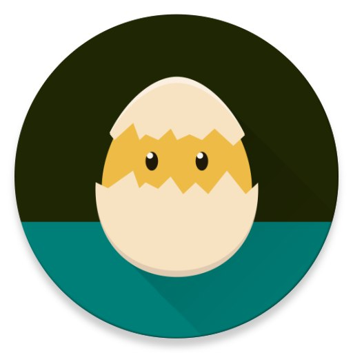

## Shelter

Visto che mi avete chiesto più approfondimenti su **Shelter** ho creato questa postilla alla guida principale.

Shelter è una applicazione Open Source per Android. 
Come tutte le applicazioni FOSS, viene reso disponibile il :link:[codice sorgente](https://gitea.angry.im/PeterCxy/Shelter). 
Per installarlo, invece, potete trovare l'applicazione nei :link:[repository di F-Droid](https://f-droid.org/packages/net.typeblog.shelter/) (quindi anche Droid-ify).

Come accennato in precedenza, Shelter è una applicazione che crea uno userspace isolato da quello primario. 
Con "isolato" intendo che praticamente non esiste coesione tra i due spazi.

Quasi tutte le versioni di Android permettono una cosa simile, ma Shelter, a differenza dagli utenti di Android, funziona contemporaneamente all'istanza principale. 
Diversamente, utilizzando gli utenti del sistema Android, per passare da una applicazione all'altra, dovrete cambiare utente; con Shelter, invece, funzioneranno contemporaneamente.

Vediamo meglio il funzionamento e alcuni casi d'uso di questa app.

Dopo aver installato Shelter da Dorid-ify (o F-Droid), vi viene creato uno spazio secondario chiamato Work, questo secondo profilo potrà contenere dati e applicazioni separate dall'istanza principale.

*Casi d'uso:*
Generalmente, quando progetto la configurazione di un un dispositivo, io consiglio di installare Shelter ed al suo interno degli app store separati da quelli dell'istanza principale, quindi:
✔️ una seconda istanza di Droid-ify (F-Droid)
✔️ Aurora Store.

Con Shelter potete innanzitutto *clonare* applicazioni dal profilo primario, quindi, droid-ify può essere clonato.
Aurora Store, invece, io consiglio di installarlo **solo** nel profilo di lavoro, ora vediamo perchè.

Il mio suggerimento è di utilizzare solo applicazioni foss (open source) nello spazio primario e limitare allo spazio secondario le applicazione closed.

In questo modo sarà possibile mantenere un alto livello di privacy per tutto quello che rimane nello spazio principale e lasciano tutta l'eventuale "sporcizia closed" nello spazio separato.

Il bello di Shelter è che questi due spazi, pur essendo simultanei, non sono assolutamente collegati. Le applicazioni dello spazio di lavoro, non hanno accesso ai dati dello spazio primario e viceversa. Per questo motivo è necessario che vengano clonati dallo spazio primario app di gestione tipo "galleria" o "gestione file" 

#### File
L'app per gestire il file è l'unica che ha accesso ad entrambe gli spazi e permette la movimentazione dei dati tra le due partizioni.

#### Condivisione
La condivisione dei contenuti non è possibile direttamente tra i due spazi.
Mi spiego meglio con un esempio.
Voi scattate fotografie con l'applicazione foto nello spazio principale, ma poi volete condividerle con Wathsapp nello spazio secondario. Whathsapp non non ha accesso alle foto dello spazio principale.
**Come fare?**

La trasmissione dei contenuti è disponibile in due modi.
1. Copiando tramite File il contenuto nello spazio da cui vogliamo condividerlo;
2. Andare sul contenuto (foto, file, musica) ed utilizzare la funzione "condividi" facendo questo sarò possibile scegliere applicazioni sia dello spazio di lavoro principale che del secondario.

I due spazi sono volutamente isolati, perchè, nel caso in cui un software cloesd (quindi installato nella partizione secondaria), dovesse grabbare dati, non avrebbe accesso alla vostra partizione principale dove dovreste tenere i vostri dati più "sensibili" .

Spero che questo breve approfondimento possa avervi chiarito eventuali dubbi.
Nel caso discutiamone liberamente nel gruppo e se sarà il caso, aggiungerò info quì.

#### Telefono Privato
Da suì puoi tornare alla :link[guida sui telefoni privati](README.md)

#### Contatti 
Per parlare con me di questa guida, unitevi al :link:[mio gruppo telegram](https://t.me/+GlEaD0WD53BmNGE0).

 